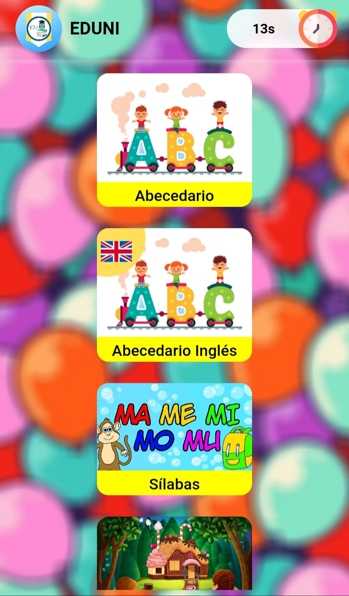
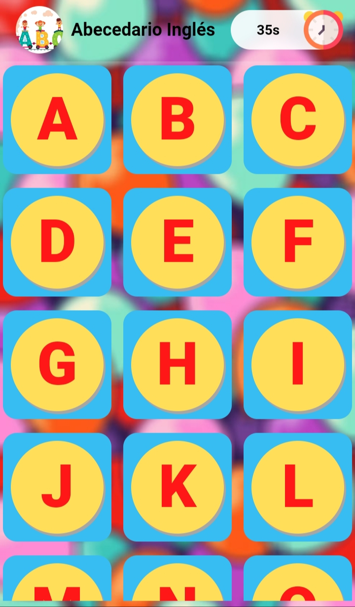
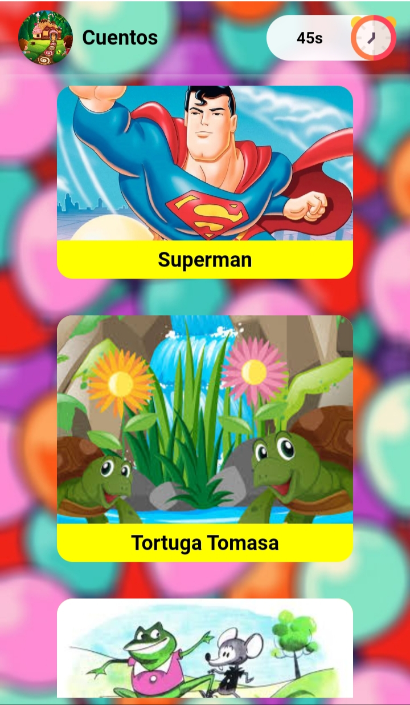

# EDUNI

[EDUNI Page](https://denisamador24.github.io/eduni/)
https://denisamador24.github.io/eduni/
 
The application that helps children learn the Spanish and English alphabet, some syllables and as extra material learn to read stories. With the aim of providing a tool to teachers of initial education to teach reading.

La aplicación que ayuda a los niños a aprender el abecedario español e inglés, alguna sílabas y como material extra aprender a leer cuentos. Con el objetivo de brindar una herramienta a los profesores de educación inicial para enseñar a leer.

___

### Alphabet | Abecedario
  

### Stories | Cuentos
